# SSAFY 최종 관통 프로젝트 - B조

## 👥 팀원 소개

### 김현재

- 팀장
- 메인 기능 담당
- 디자인 및 발표 담당

### 이언지

- 팀원
- 유저 담당
- 잡무 담당

 

## 🏗️ 아키텍처

- Java 기반 Spring Boot 프레임워크를 활용하여 MVC 구조로 설계
- ORM 프레임워크로 MyBatis를 도입하여 MySQL과의 데이터 연동을 구현
-  

## ⚙️ 기술 스택

| 항목         | 기술        |
| ------------ | ----------- |
| 언어         | Java 17     |
| 프레임워크   | Spring Boot |
| 뷰           | Vue 3       |
| 데이터베이스 | MySQL       |
| ORM          | MyBatis     |
| 빌드 도구    | Maven       |

 

## 📝 세부 사항 및 문제점

⭐ USER 관련 (언지)

[언지 리드미 보기](./aboutPJT/이언지README.md)

#### 0. 공통

- IME 입력기에서 한글 입력 감지가 매끄럽지 않아서 input 필드에서 한글 입력 시 조건 검사가 안 되는 문제 해결 필요
- 에러 메시지 분기 처리 세분화 필요

#### 1. 회원가입

입력값 유효성 검사 (정규식, input 이벤트 사용한 처리)

- 비밀번호 암호화
  - 백엔드의 Service 단계에서 암호화 처리해주고 있기 때문에 컨트롤러까지는 평문으로 담겨 거쳐가는 문제.  
     프론트 측 비밀번호 암호화 처리 필요성에 대한 고민
- 어떤 요소를 어떤 타이밍에 검사하여 경고를 띄워줄지, 함수 호출이 불필요하게 많거나 로직이 비효율적이진 않은지 등등  
  효율성과 UX 측면에서 판단하는 게 까다로웠음

#### 2. 로그인

JWT를 활용한 로그인 처리 및 요청 인가 처리  
프론트는 navigagion guard, 백엔드는 spring security 사용

- 토큰 만료 시 강제 로그아웃 되는 문제 -> 추후 refresh 토큰 발급 방안 고려
- 토큰 상태 변화를 자동으로 감지하여 로그인 상태를 동기화하는 데서 어려움을 겪음  
   특히 header는 자주 새로 mount 되는 요소가 아니기 때문에 싱크 맞추기 어려웠음
  - sessionStorage에 어디까지 저장해도 되느냐에 대한 고민.  
    user 객체 자체를 저장하면 관리하기 편하지만 민감한 개인정보가 포함될 수도 있다는 우려.

#### 3. 아이디 찾기

개인정보를 활용한 아이디 찾기

- 현재 닉네임, 전화번호, 이메일이 unique 필드가 아님. 추후 식별 가능한 필드를 통한 검증 로직 필요

#### 4. 비밀번호 찾기

아이디와 전화번호를 활용한 본인인증 후 비밀번호 재설정

- 비밀번호를 암호화 처리하면서 user의 원래 비밀번호를 가져오는 게 어려움 + 보안상의 이유로 비밀번호 찾기보다 재설정이 적합할 것이라고 판단
- form 태그 안에 본인인증 버튼과 제출 버튼이 들어가는데, 현재 어느 버튼을 누르든 submit 으로 넘어가는 문제  
  -> 본인인증 기능 도입 시 각기 동작하도록 처리 필요

##### 4-1. 비밀번호 재설정

이전과 동일하지 않은 새로운 비밀번호로 재설정

- 백엔드로 재설정 정보 저장 시 userId와 새로운 비밀번호를 평문으로 객체에 담아서 전달  
  -> 요청을 가로채면 조작 가능하지 않을까 하는 우려. 처리 방법 고민 필요.

#### 5. 마이페이지

요청을 구분하여 팔로잉리스트, 팔로워리스트, 좋아요 한 영상 리스트, 유저 검색 결과 등 다른 콘텐츠 제공

- 초기에는 RouterView로 화면에 띄웠는데, 중간에 v-if 로 조건부 렌더링 처리

##### 5-1. 유저 검색

닉네임으로 유저를 검색하여 팔로우/언팔로우 가능

- 검색어를 입력한 채로 팔로잉 목록 보기 요청을 보내는 경우 잠깐 팔로잉 목록이 떴다가 default(좋아요 한 영상)로 튕기는 문제
  - searchbar input 을 watch 로 감지했기 때문에 following 으로 이동하면서 value를 빈 문자열로 바꾸는 것도 이벤트로 인식하여 onSearch 함수 호출  
    -> 분기 처리를 세분화하여 해결

#### 6. 회원 정보 수정

비밀번호 인증 후 회원 정보 수정

##### 6-1. 프로필 사진

프로필 사진 등록 및 삭제 (삭제 시 기본 이미지로 변경)

- 프로필 사진을 등록하면 header와 마이페이지 내 화면에서 동시에 바뀌도록 처리해주는 게 어려웠음
- 폼 제출 버튼을 누르기 전에는 미리보기만 변경되고, 수정 완료 버튼을 누르면 프로필 사진이 표시되는 부분들 일괄 변경되도록 처리
- 유저가 프로필 사진을 변경할 때마다 서버 측에 새로운 파일로 저장되는 문제 발견  
   -> 기존 파일 삭제 후 새로운 이미지 저장하는 방식으로 해결

#### 7. 팔로우

마이 페이지 내에서 following, follower 유저 목록 확인 가능  
유저 목록에서 내가 이미 팔로우하고 있는지 여부에 따라 다른 버튼 UI (following / follow) 제공  
본인 팔로우 불가능

- Following / Follower 목록을 요청하는 버튼은 마이페이지 컴포넌트에 포함되어 있고, 유저 리스트는 별개의 컴포넌트라 팔로우 동작에 따라 숫자 갱신하는 데서 어려움을 겪음
  - 이벤트 발생에 따라 숫자를 ++, -- 로 직접 조정하는 방식은 빠르고 간편하지만 오류 발생 시 db와 데이터가 달라질 우려가 있었고, 심지어 중간에 꼬여서 음수값으로 넘어가는 경우도 생겼음
  - 그렇다고 매번 유저 정보를 갱신하자니 뭔가 비효율적으로 정보를 다 가져오는 느낌
  - 어차피 유저 목록을 띄워야 하므로, 팔로잉 팔로우 목록을 불러오면서 불러온 배열의 length 값과 함께 emit 하는 방식으로 해결
- 백엔드에서 리스트 불러올 때 매번 불러온 배열 전체를 돌면서 isFollowed 여부를 체크해서 매핑하고 가져오는 게 언짢았음. 더 효율적인 방법이 있지 않았을까.
  - lombok 에서는 boolean형 변수명을 isFollowed로 지으면 getter setter에서 자동으로 is를 떼고 인식함.
  

⭐ MAIN 기능 관련 (현재)

[현재 리드미 보기](./aboutPJT/김현재README.md)

#### 0. 공통

- UX 측면에서 디테일 개선 필요

#### 1. 영상 검색

제목으로 영상 검색 가능

- 채널명, 제목 등 다양한 조건 검색 가능하도록 기능 개선 가능

#### 2. 영상 정렬

조회순, 좋아요순 영상 정렬

#### 3. 영상 상세

##### 3-1. 조회수 업데이트

영상 상세 페이지 조회 시 조회수 업데이트

#### 4. 영상 좋아요

영상 좋아요 시 마이 페이지에서 내가 좋아요 한 영상 목록 확인 가능

- 메인 화면에서도 좋아요 여부에 따라 UI 바뀌도록 개선 가능

#### 5. 리뷰

  

 
 

## 📌 최종 화면 디자인

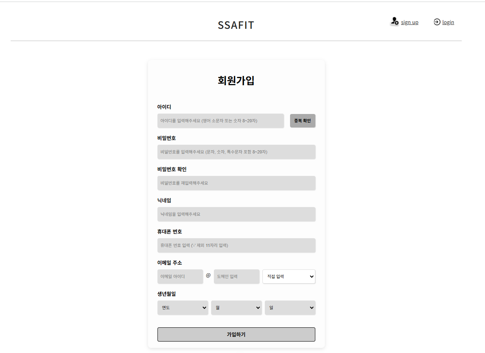
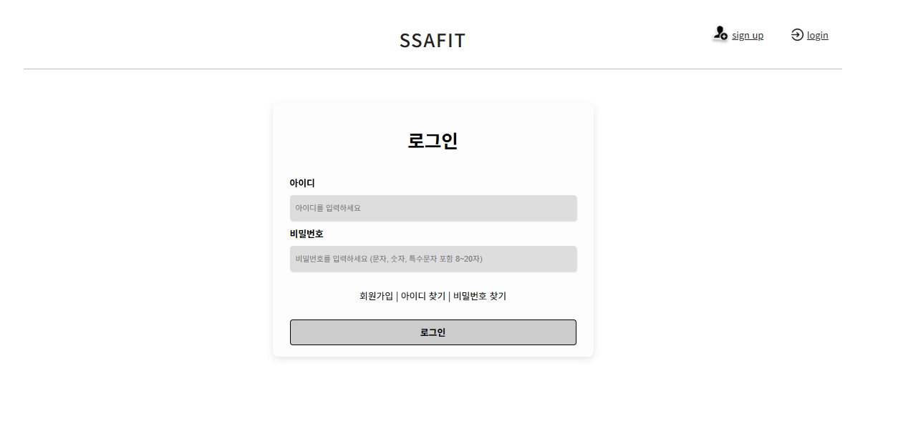
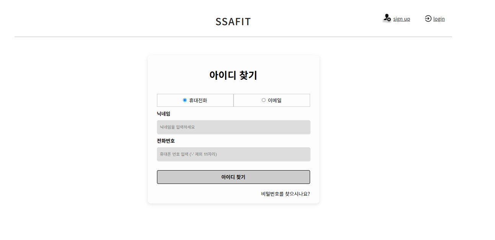
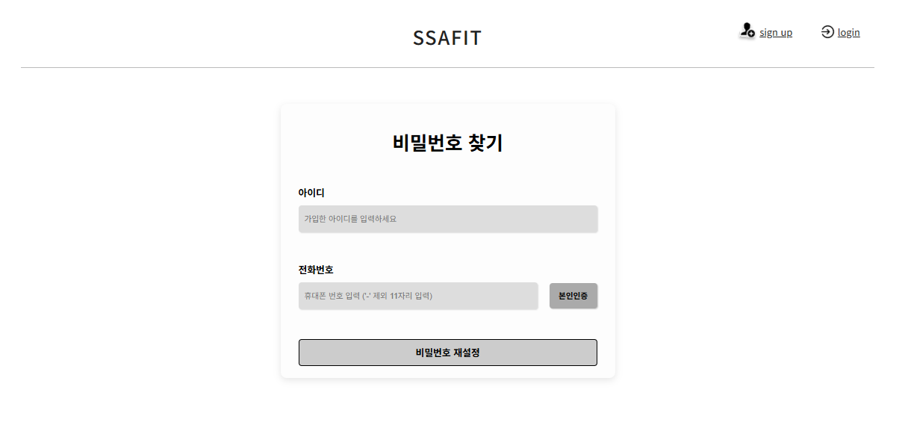
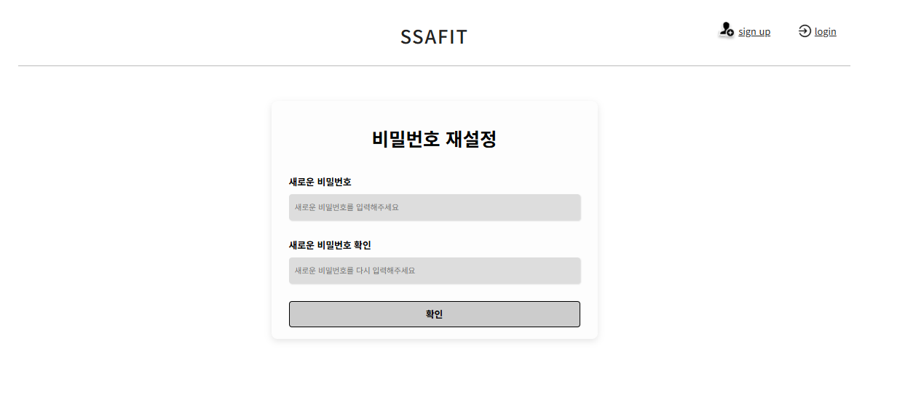
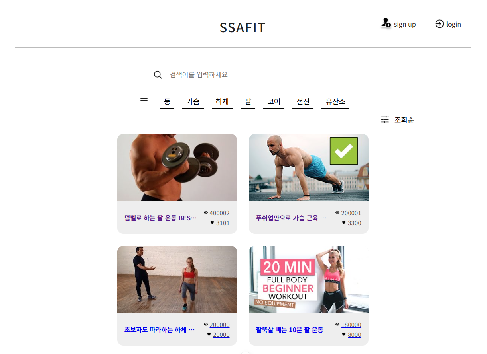
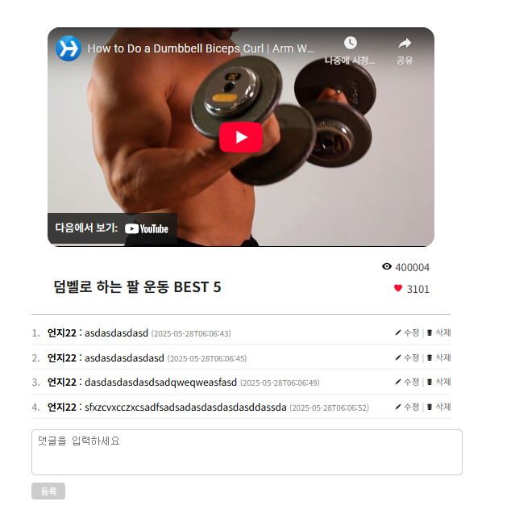
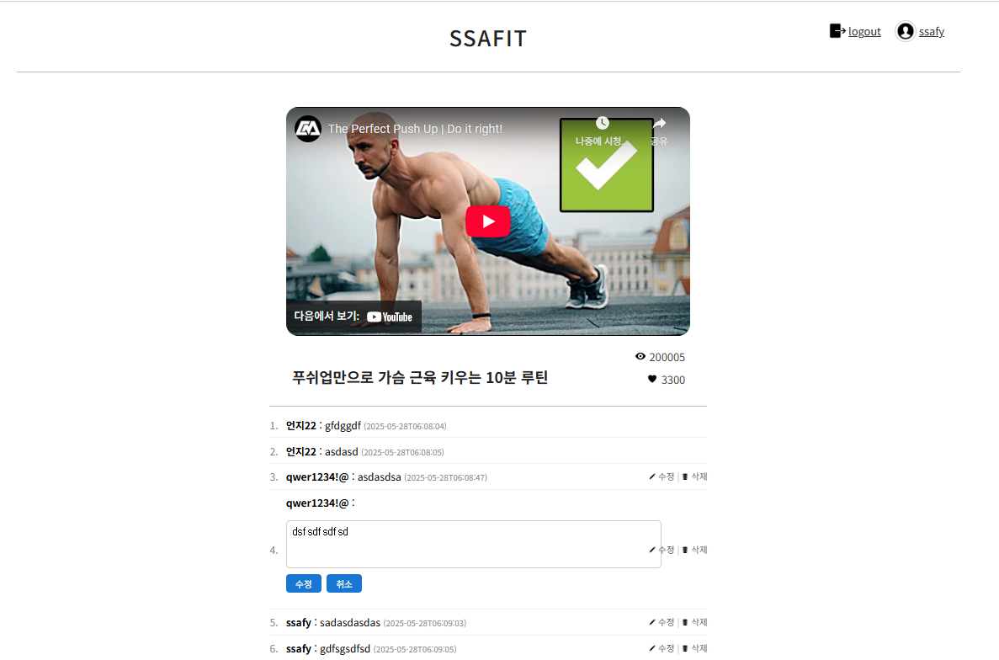
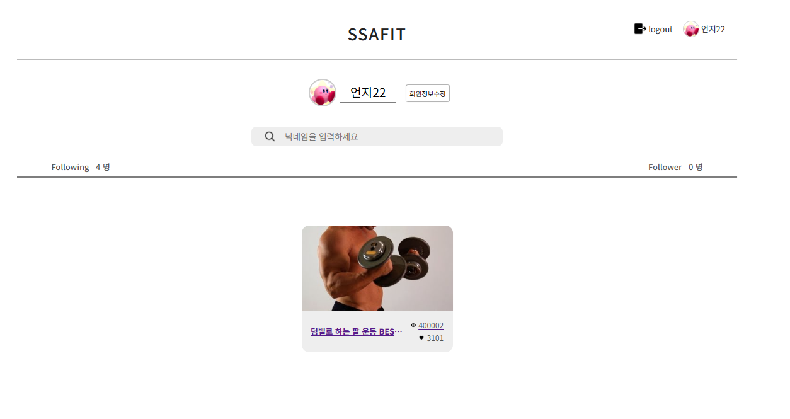
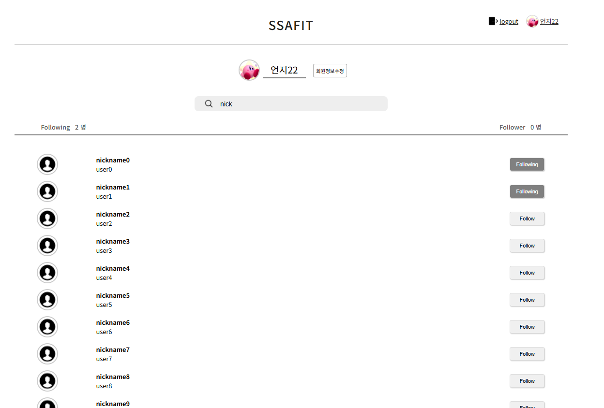
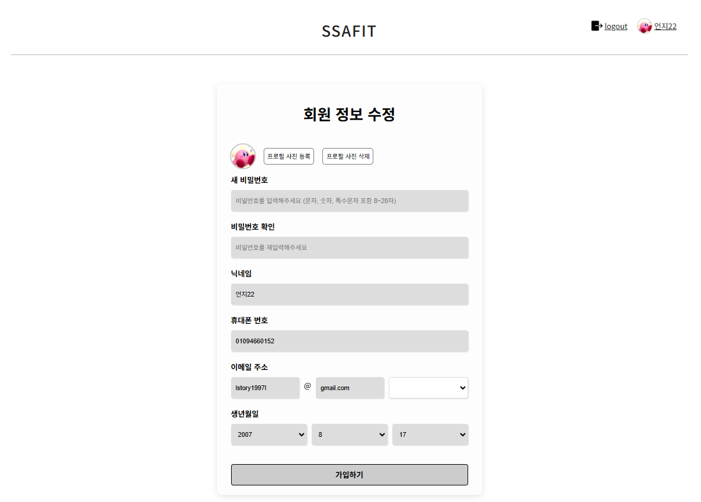
