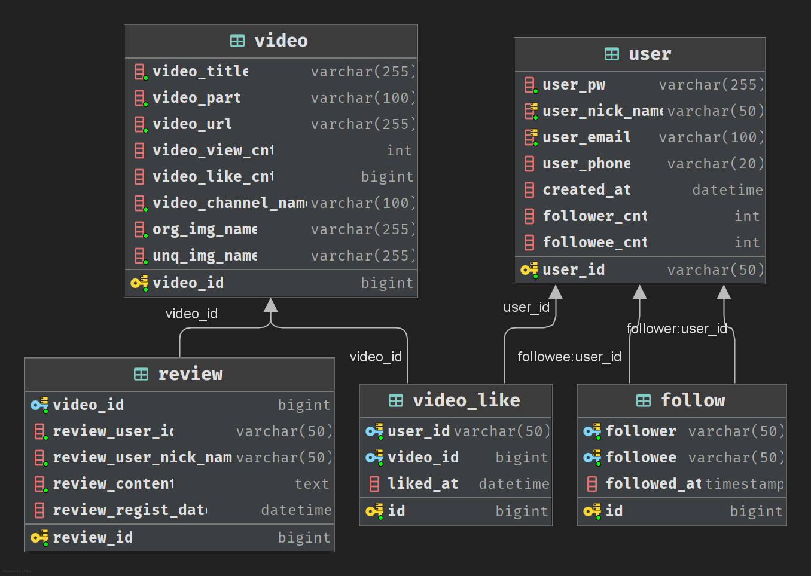
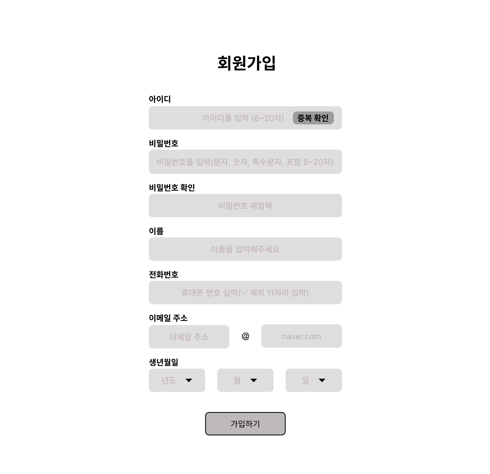
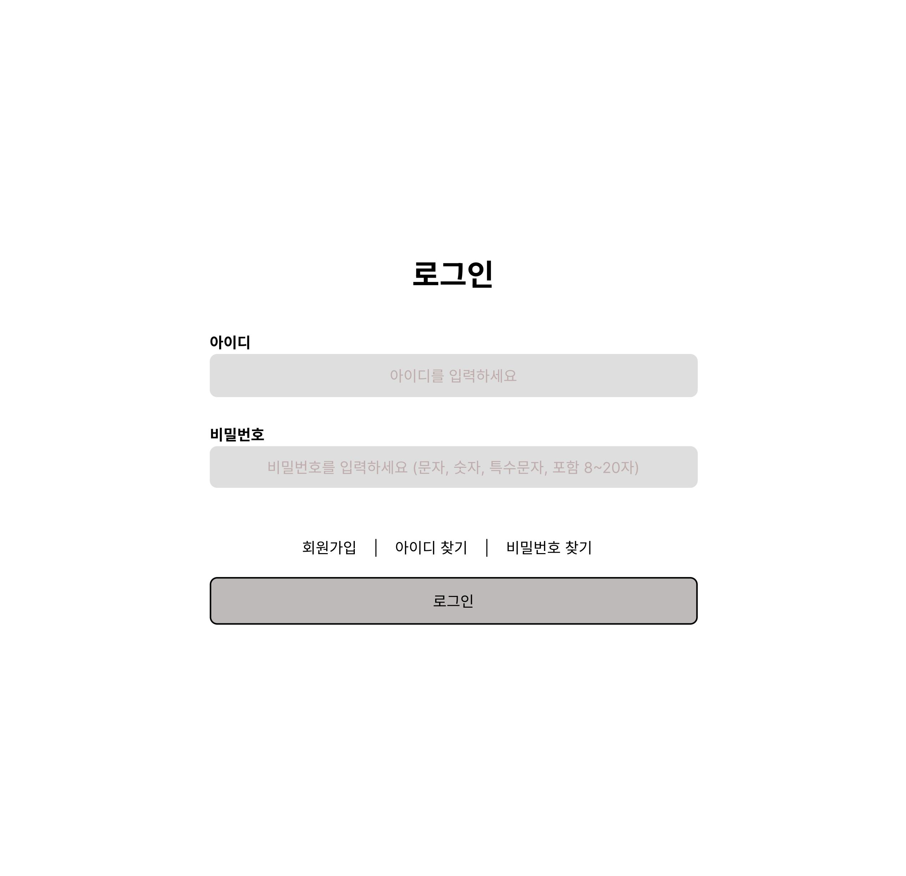
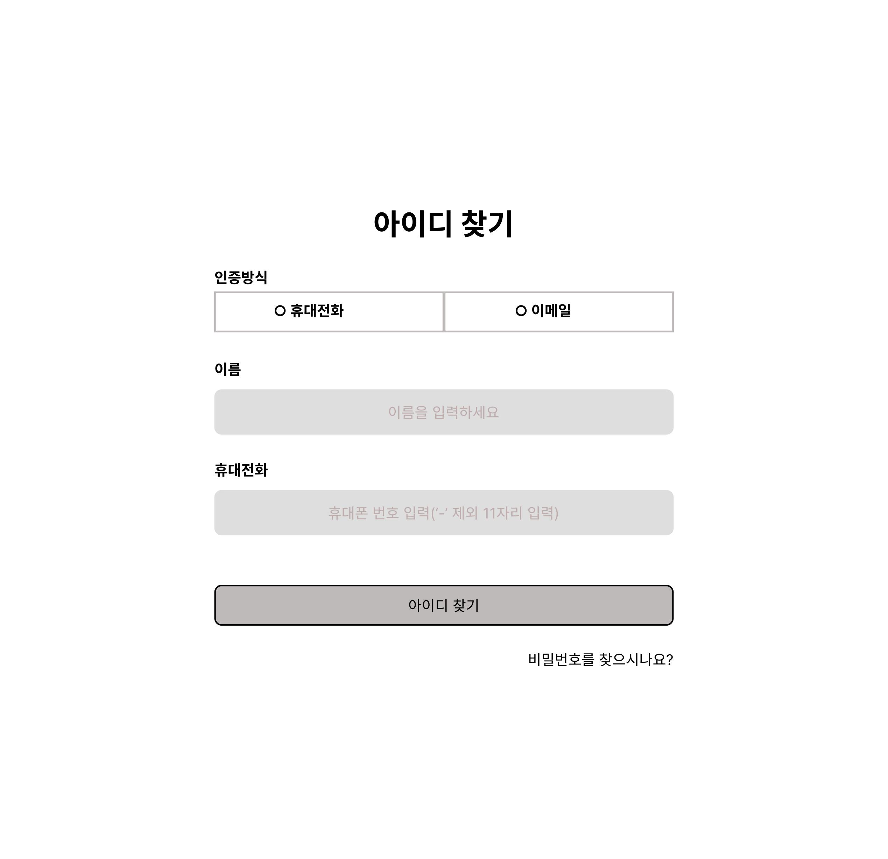
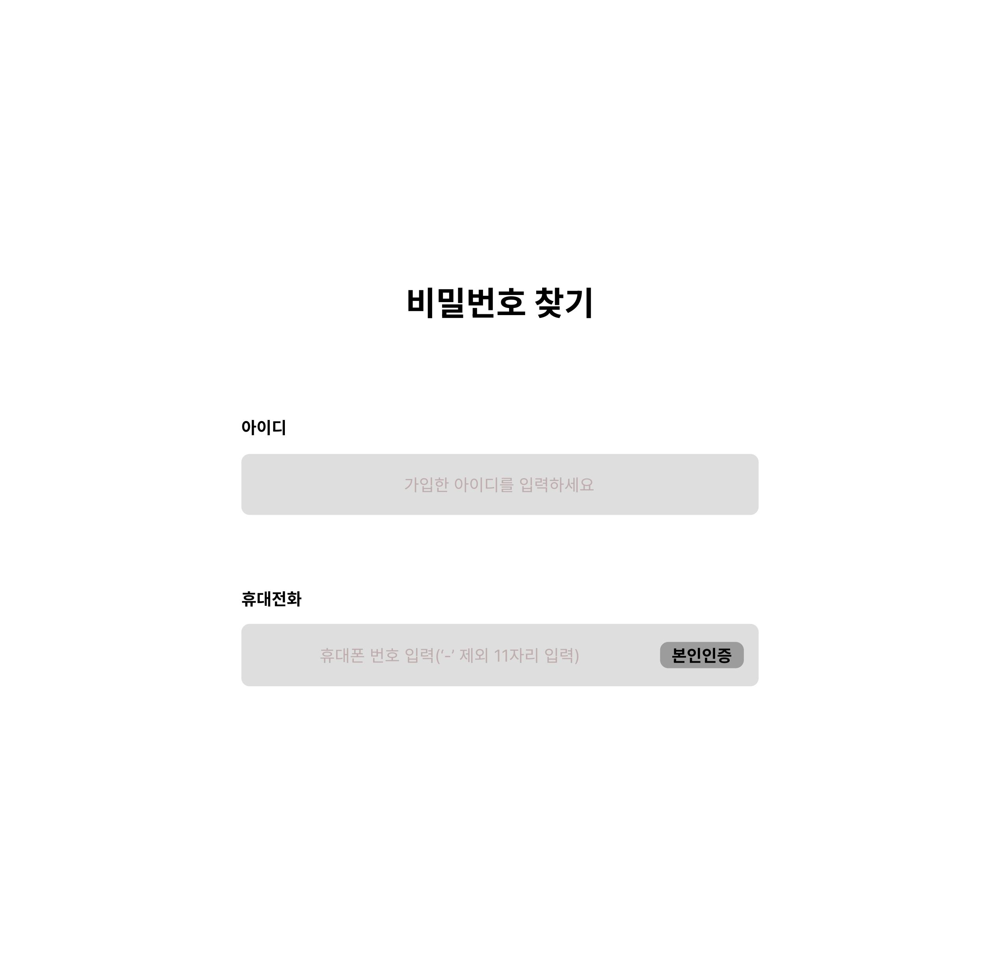
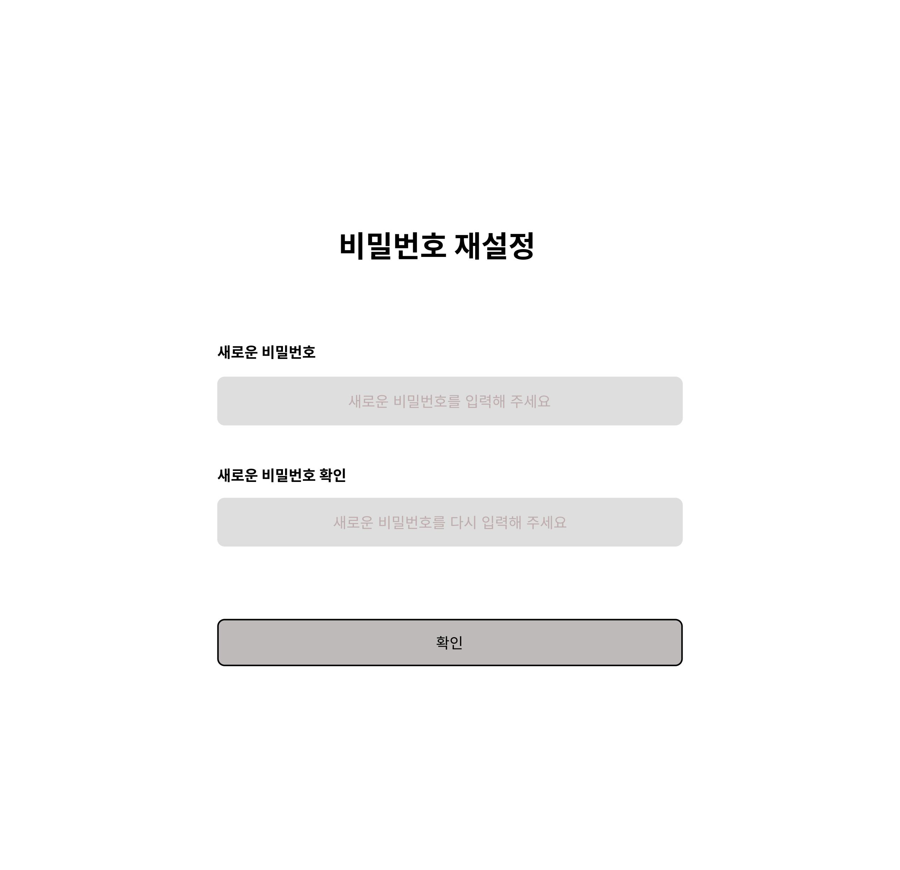
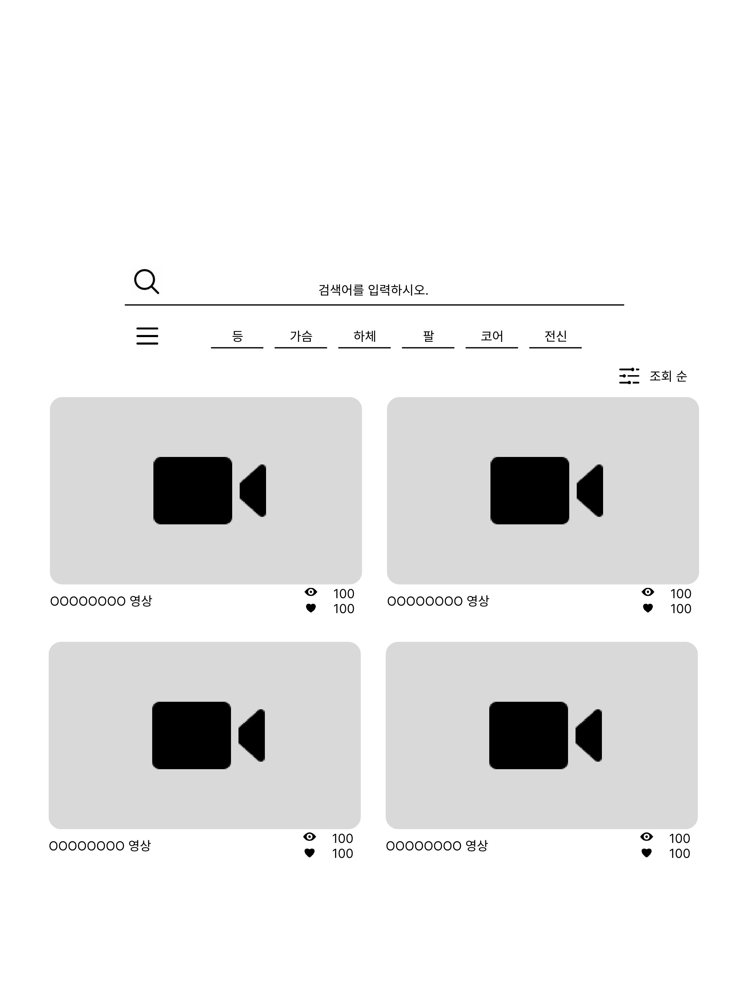
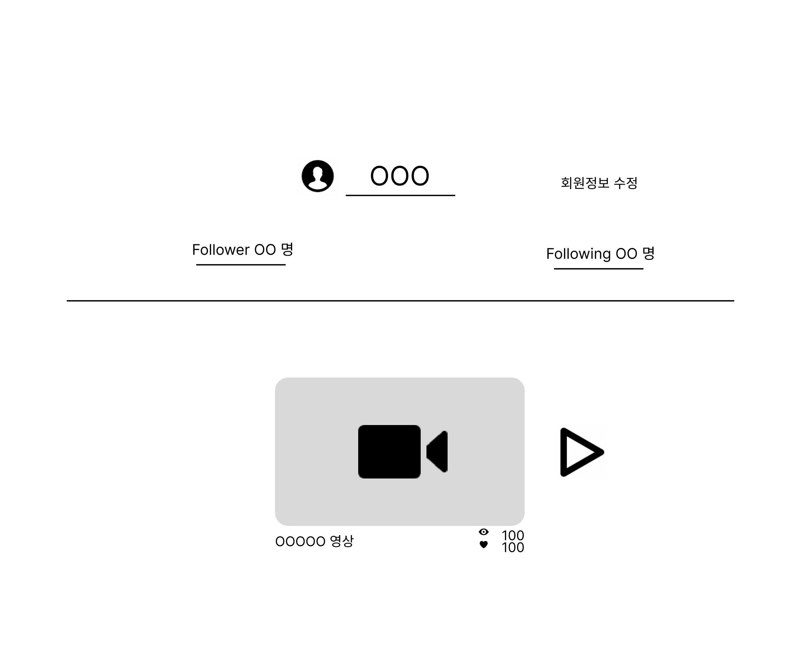
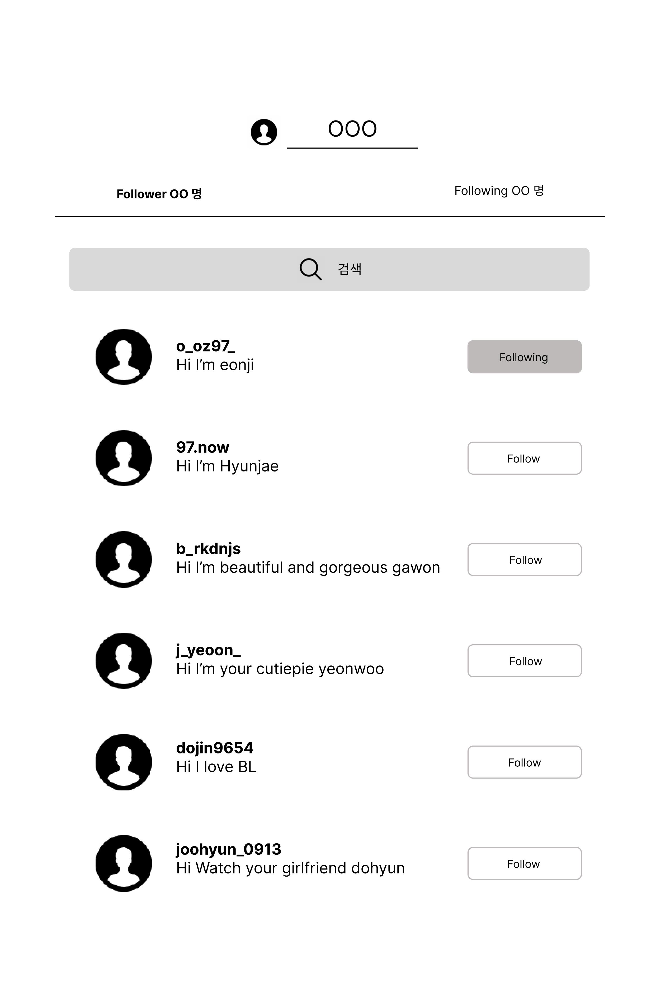

# SSAFY 최종 관통 프로젝트

## 🏗️ 아키텍처

- Java 기반 Spring Boot 프레임워크를 활용하여 MVC 구조로 설계
- ORM 프레임워크로 MyBatis를 도입하여 MySQL과의 데이터 연동을 구현

## ⚙️ 기술 스택

| 항목         | 기술                               |
| ------------ | ---------------------------------- |
| 언어         | Java                               |
| 프레임워크   | Spring Boot                        |
| 뷰           | HTML, JavaScript (Fetch / AJAX)    |
| 데이터베이스 | MySQL                              |
| ORM          | MyBatis                            |
| 빌드 도구    | Maven                              |
| 서버         | 내장 Tomcat (Spring Boot Embedded) |

 
 
 

## 📌 기능 명세서

### 👤 사용자 관리

| **기능명**     | **설명**                             | **관련 화면**        | **관련 API**                |
| -------------- | ------------------------------------ | -------------------- | --------------------------- |
| 회원가입       | 사용자 정보를 입력받아 회원 등록     | 회원가입 화면        | `POST /api/user`            |
| 로그인         | 로그인 정보를 입력해 세션 생성       | 로그인 화면          | `POST /api/user/login`      |
| 내 정보 조회   | 세션을 기반으로 유저 정보 조회       | 마이페이지           | `GET /api/user/{userId}`    |
| 회원 목록 조회 | 전체 유저 목록 보기 (관리자 전용 등) | 관리자 페이지        | `GET /api/user`             |
| 회원 정보 수정 | 유저 본인의 정보 수정                | 마이페이지 수정 화면 | `PUT /api/user/{userId}`    |
| 회원 탈퇴      | 회원 탈퇴 처리                       | 마이페이지           | `DELETE /api/user/{userId}` |

---

### 🎬 비디오 관리

| **기능명**     | **설명**                            | **관련 화면**         | **관련 API**                  |
| -------------- | ----------------------------------- | --------------------- | ----------------------------- |
| 비디오 업로드  | 동영상과 정보를 함께 업로드         | 영상 업로드 화면      | `POST /api/video`             |
| 영상 목록 보기 | 전체 또는 검색조건에 맞는 영상 보기 | 메인 / 검색 결과 화면 | `GET /api/video`              |
| 영상 상세 보기 | 영상 클릭 시 상세 정보 및 영상 표시 | 영상 상세 페이지      | `GET /api/video/{videoId}`    |
| 영상 수정      | 기존에 올린 영상을 수정             | 영상 수정 화면        | `PUT /api/video/{videoId}`    |
| 영상 삭제      | 본인이 업로드한 영상 삭제           | 마이페이지 > 내 영상  | `DELETE /api/video/{videoId}` |

---

### ❤️ 좋아요 기능

| **기능명**               | **설명**                                | **관련 화면**       | **관련 API**                                              |
| ------------------------ | --------------------------------------- | ------------------- | --------------------------------------------------------- |
| 영상 좋아요              | 영상에 좋아요 누르기                    | 영상 상세 페이지    | `POST /api/video-like`                                    |
| 좋아요 목록 보기         | 내가 누른 영상 목록 조회                | 마이페이지 > 좋아요 | `GET /api/video-like/user/{userId}`                       |
| 팔로잉한 유저들의 좋아요 | 내가 팔로우한 유저들의 좋아요 영상 조회 | 추천 영상 탭        | `GET /api/video-like/user/{userId}/following`             |
| 좋아요 여부 확인         | 영상 상세 내 좋아요 상태 체크           | 영상 상세 페이지    | `GET /api/video-like/user/{userId}/video/{videoId}/check` |
| 좋아요 개수 조회         | 영상별 좋아요 수 표시                   | 영상 리스트/상세    | `GET /api/video-like/video/{videoId}/count`               |
| 좋아요 취소              | 좋아요 취소                             | 영상 상세 페이지    | `DELETE /api/video-like/user/{userId}/video/{videoId}`    |

---

### 📝 리뷰 기능

| **기능명**       | **설명**                             | **관련 화면**               | **관련 API**                    |
| ---------------- | ------------------------------------ | --------------------------- | ------------------------------- |
| 리뷰 작성        | 영상에 대한 리뷰 작성                | 영상 상세 페이지            | `POST /api/review`              |
| 조건별 리뷰 조회 | 영상 ID, 유저 ID 등에 따른 리뷰 검색 | 영상 상세, 관리자 리뷰 관리 | `GET /api/review`               |
| 전체 리뷰 보기   | 전체 리뷰 목록 조회                  | 관리자 리뷰 관리            | `GET /api/review/all-review`    |
| 리뷰 상세 조회   | 리뷰 내용 자세히 보기                | 영상 상세 페이지            | `GET /api/review/{reviewId}`    |
| 리뷰 수정        | 작성한 리뷰 수정                     | 마이페이지 > 내 리뷰        | `PUT /api/review/{reviewId}`    |
| 리뷰 삭제        | 리뷰 삭제                            | 마이페이지 > 내 리뷰        | `DELETE /api/review/{reviewId}` |

---

### 👥 팔로우 기능

| **기능명**       | **설명**                   | **관련 화면**            | **관련 API**                         |
| ---------------- | -------------------------- | ------------------------ | ------------------------------------ |
| 팔로우 추가      | 다른 유저 팔로우 등록      | 유저 프로필, 영상 상세   | `POST /api/follow`                   |
| 팔로잉 목록 보기 | 내가 팔로우한 유저 리스트  | 마이페이지 > 팔로잉      | `GET /api/follow/{userId}/following` |
| 팔로워 목록 보기 | 나를 팔로우한 유저 리스트  | 마이페이지 > 팔로워      | `GET /api/follow/{userId}/follower`  |
| 팔로우 여부 확인 | 특정 유저 팔로우 여부 확인 | 유저 프로필              | `GET /api/follow/{followeeId}/check` |
| 팔로우 취소      | 팔로우 관계 해제           | 마이페이지 > 팔로잉 관리 | `DELETE /api/follow/{userId}`        |

 
 
 

## 📌 API 명세서

### 🔐 User API `/api/user`

| Method | Endpoint             | 설명           | 요청 데이터       | 응답             | 상태코드                          |
| ------ | -------------------- | -------------- | ----------------- | ---------------- | --------------------------------- |
| POST   | `/api/user`          | 유저 등록      | User JSON         | 생성된 User      | `201 Created`                     |
| POST   | `/api/user/login`    | 로그인         | LoginRequest JSON | 없음 (세션 저장) | `200 OK`                          |
| GET    | `/api/user/{userId}` | 단일 유저 조회 | 없음              | User             | `200 OK`, `404 Not Found`         |
| GET    | `/api/user`          | 전체 유저 조회 | 없음              | List<User>       | `200 OK`, `204 No Content`        |
| PUT    | `/api/user/{userId}` | 유저 수정      | User JSON         | 수정된 User      | `200 OK`, `404 Not Found`         |
| DELETE | `/api/user/{userId}` | 유저 삭제      | 없음              | 없음             | `204 No Content`, `404 Not Found` |

---

### 🎬 Video API `/api/video`

| Method | Endpoint               | 설명                           | 요청 데이터                                   | 응답         | 상태코드                          |
| ------ | ---------------------- | ------------------------------ | --------------------------------------------- | ------------ | --------------------------------- |
| POST   | `/api/video`           | 비디오 등록                    | `@ModelAttribute Video`, `MultipartFile file` | 생성된 Video | `201 Created`                     |
| GET    | `/api/video`           | 비디오 검색/전체 조회          | `SearchCondition` (쿼리 파라미터)             | List<Video>  | `200 OK`                          |
| GET    | `/api/video/{videoId}` | 비디오 단일 조회 + 조회수 증가 | 없음                                          | Video        | `200 OK`, `404 Not Found`         |
| PUT    | `/api/video/{videoId}` | 비디오 수정                    | `@ModelAttribute Video`, `MultipartFile file` | 수정된 Video | `200 OK`, `404 Not Found`         |
| DELETE | `/api/video/{videoId}` | 비디오 삭제                    | 없음                                          | 없음         | `204 No Content`, `404 Not Found` |

---

### 📝 Review API `/api/review`

| Method | Endpoint                 | 설명           | 요청 데이터                 | 응답         | 상태코드                  |
| ------ | ------------------------ | -------------- | --------------------------- | ------------ | ------------------------- |
| POST   | `/api/review`            | 리뷰 등록      | Review JSON                 | 생성된 리뷰  | `201 Created`             |
| GET    | `/api/review`            | 조건 검색      | SearchCondition JSON (Body) | List<Review> | `200 OK`                  |
| GET    | `/api/review/all-review` | 전체 리뷰 조회 | 없음                        | List<Review> | `200 OK`                  |
| GET    | `/api/review/{reviewId}` | 단일 리뷰 조회 | 없음                        | Review       | `200 OK`, `404 Not Found` |
| PUT    | `/api/review/{reviewId}` | 리뷰 수정      | Review JSON                 | 수정된 리뷰  | `200 OK`, `404 Not Found` |
| DELETE | `/api/review/{reviewId}` | 리뷰 삭제      | 없음                        | 없음         | `200 OK`, `404 Not Found` |

---

### 👥 Follow API `/api/follow`

| Method | Endpoint                         | 설명             | 요청 데이터                 | 응답       | 상태코드                   |
| ------ | -------------------------------- | ---------------- | --------------------------- | ---------- | -------------------------- |
| POST   | `/api/follow`                    | 팔로우 등록      | Follow JSON                 | 없음       | `200 OK`, `409 Conflict`   |
| GET    | `/api/follow/{userId}/following` | 팔로잉 목록      | 없음                        | List<User> | `200 OK`, `204 No Content` |
| GET    | `/api/follow/{userId}/follower`  | 팔로워 목록      | 없음                        | List<User> | `200 OK`, `204 No Content` |
| GET    | `/api/follow/{followeeId}/check` | 팔로우 여부 체크 | 세션에서 로그인된 유저 필요 | Boolean    | `200 OK`, `404 Not Found`  |
| DELETE | `/api/follow/{userId}`           | 팔로우 취소      | 세션에서 로그인된 유저 필요 | 없음       | `200 OK`, `404 Not Found`  |

---

### ❤️ Video Like API `/api/video-like`

| Method | Endpoint                                              | 설명                          | 요청 데이터    | 응답        | 상태코드                      |
| ------ | ----------------------------------------------------- | ----------------------------- | -------------- | ----------- | ----------------------------- |
| POST   | `/api/video-like`                                     | 좋아요 등록                   | VideoLike JSON | 없음        | `201 Created`, `409 Conflict` |
| GET    | `/api/video-like/user/{userId}`                       | 내가 누른 좋아요 영상 목록    | 없음           | List<Video> | `200 OK`, `204 No Content`    |
| GET    | `/api/video-like/user/{userId}/following`             | 팔로잉한 유저들의 좋아요 영상 | 없음           | List<Video> | `200 OK`, `204 No Content`    |
| GET    | `/api/video-like/user/{userId}/video/{videoId}/check` | 좋아요 여부 확인              | 없음           | Boolean     | `200 OK`, `404 Not Found`     |
| GET    | `/api/video-like/video/{videoId}/count`               | 영상 좋아요 수                | 없음           | Long        | `200 OK`, `404 Not Found`     |
| DELETE | `/api/video-like/user/{userId}/video/{videoId}`       | 좋아요 취소                   | 없음           | 없음        | `200 OK`, `404 Not Found`     |

 
 
 

## 📌 ERD

## 📌 화면 디자인

